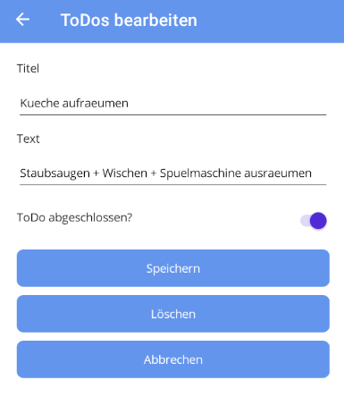
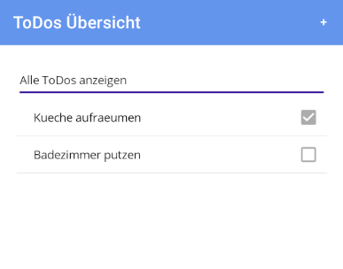
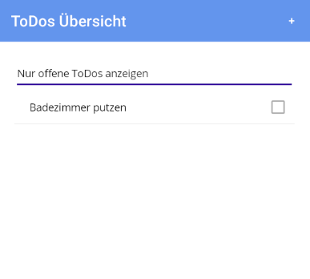

# ToDo-MAUI

This application has the task of displaying a to-dos board in a MAUI Android application and persisting it via API commands to a .NET Core backend with an in-memory database.

## Backend
The backend is based on the target framework .NET 8.0. to-dos are persisted via CRUD (Create, Read, Update, Delete) with the help of an in-memory database.

### Specifications

- RESTful API using ASP.NET Core that allows CRUD operations for to-dos
- In-memory database to store to-dos
- API communication should be possible via HTTP requests
- Unit Tests for the backend to validate functionality of the RESTful API
  
### How to run

1. Open the ToDo.sln in Rider or Visual Studio
2. Execute configuration "BACKEND:http" to run the application
3. Use CRUD-Commands by sending the following HTTP-Commands:
4. GET all to-dos in database: http://127.0.0.1:5036/api/todo/read
5. POST single to-do to add into database: http://127.0.0.1:5036/api/todo/create
6. PUT single to-do to modify existing todo in database: http://127.0.0.1:5036/api/todo/update/_idOfToDo_
7. DELETE single to-do in database: http://127.0.0.1:5036/api/todo/delete/_idOfToDo_

## Frontend
The front end is designed as a MAUI Android application. All to-dos are to be displayed in an overview and made selectable. It should be possible to create, modify, filter and delete to-dos via the interface.

### Specifications

- Mobile application using MAUI that communicates with the RESTful API and provides basic CRUD functionality
- Runnable on Android
- MVVM-Architecture
- Dependency-Injection for API communication
- Displays list of to-dos from Backend
- Allows to create, modify, delete and filter to-dos

### How to run

1. Open the ToDo.sln in Rider or Visual Studio
2. Configure any Android Emulator with API Level 36 device and select the device inside the IDE
3. Execute configuration "FRONTEND" to run the application (you will be routed to the MainPage which is to-do-overview)
4. Press "+" button in the upper right to add a new to-do (to persist your input please press "Speichern")
5. Press any list item to modify to-do (to persist your input please press "Speichern", if you want to delete an entry please press "Löschen")
6. By selecting "Filtern..." inside the overview you'll be able to filter your list based on "IsCompleted"-Property

## Images

